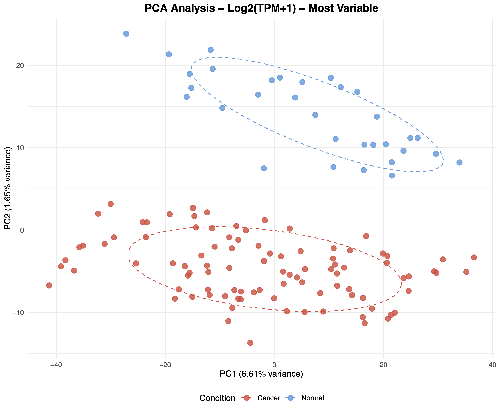
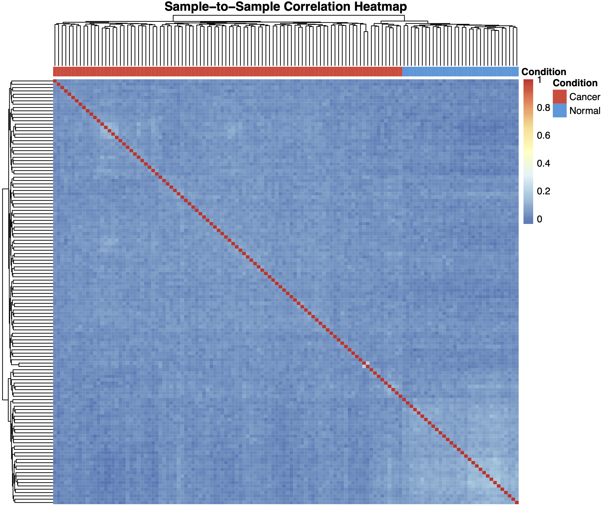
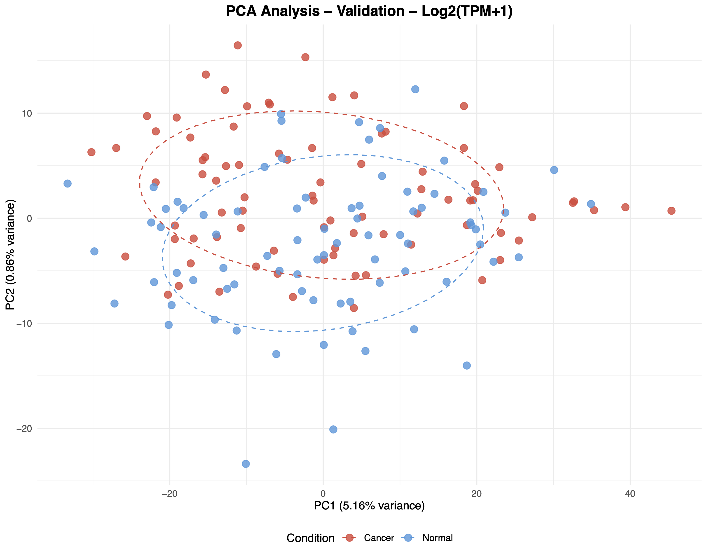
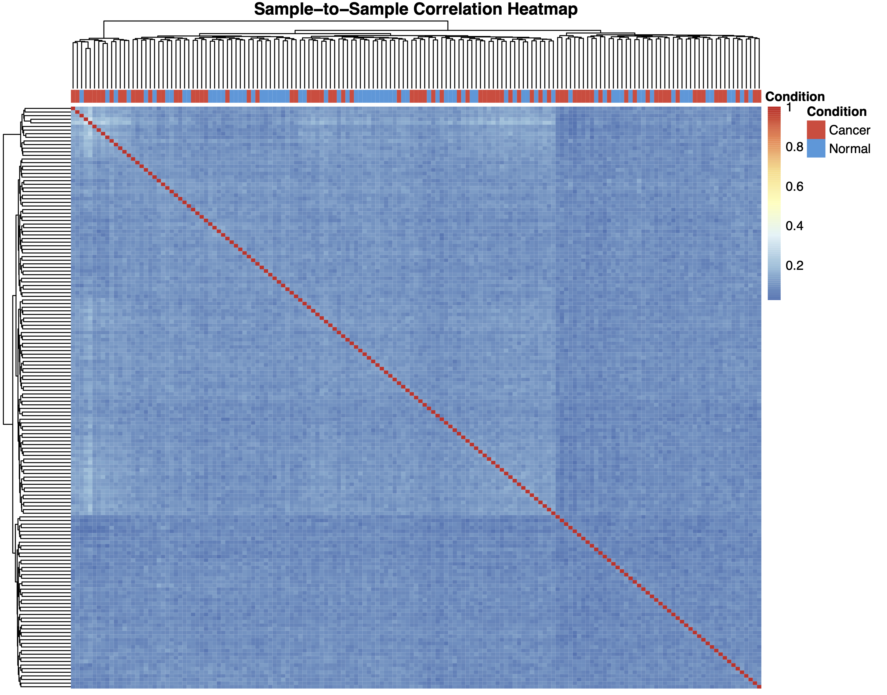
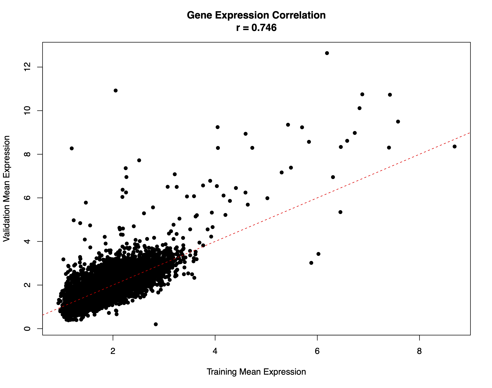
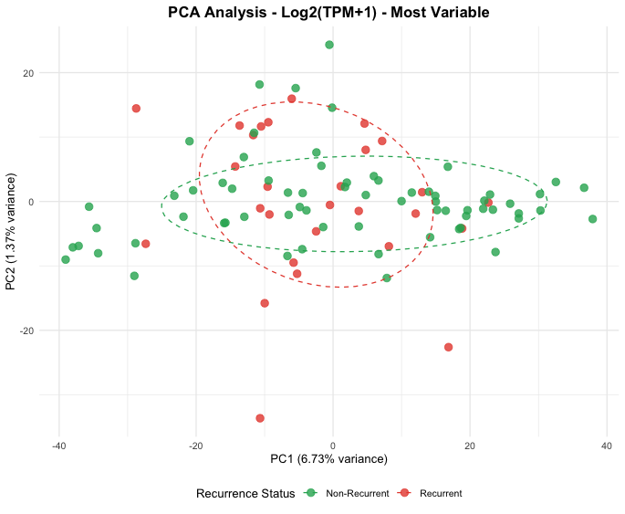
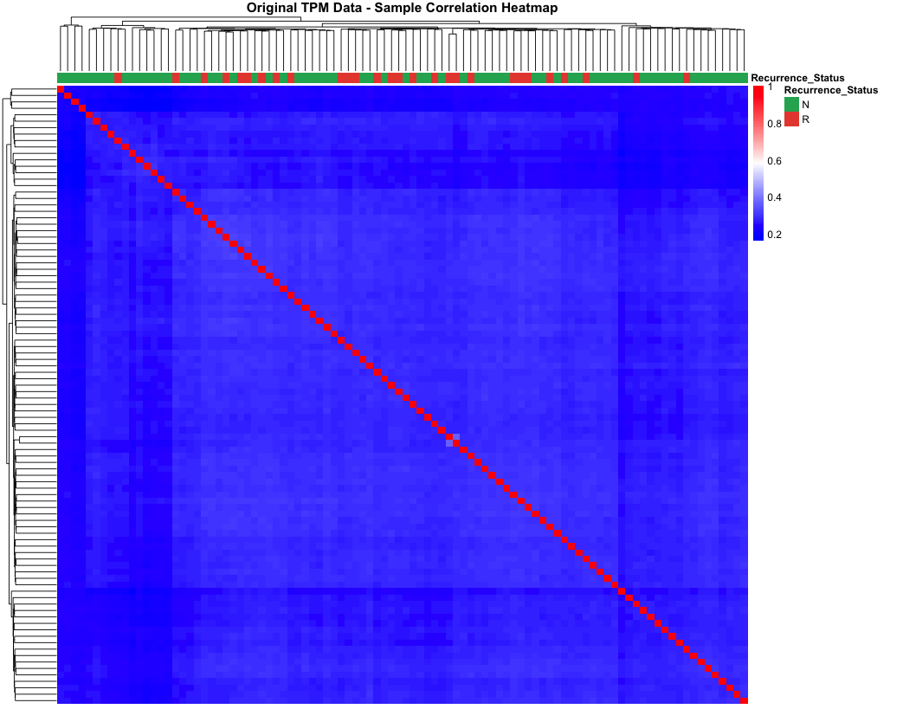

# TPM Gene Expression Data Preprocessing

Feel free to overwrite this. 

Hanchang Cai (May 24, 2025)

## 1. Dataset Overview

**File:** `data/combined_tpm_5000genes.csv`

**Structure:**

- Rows: 128 samples (96 cancer + 32 normal)
- Columns: 5,002 total
  - 5,000 gene expression features (top variable genes)
  - 1 `target` column (0=Normal, 1=Cancer)
  - 1 `condition` column (Cancer/Normal)

**Ready-to-use:** no further QC is needed, but you can still consider Recursive Feature Elimination etc. as further feature selection methods.

> Common genes between datasets: 60675
>  
> Genes after filtering: 50379
>  
> Selected features for ML: 5000 

---

Same pipeline for validation: `data/valid_dataset.csv`. **NO genes are missing** from training to validation dataset. Final Validation dataset dimensions: **161 Rows (83 cancer + 78 normal), 5002 Cols**.

> Total genes in validation: 60675
>
> Common genes with training: 5000 

## 2. Preprocessing Summary

<u>**Note**: I decided to use TPM instead of raw counts after some experiments.</u>

#### What Was Done

1. **Quality Control**
   
   - Filtered low-expression genes (mean TPM < 1)
   - Kept 50,379/60,675 genes after filtering
2. **Transformation**
   
   - Applied Log2(TPM + 1) transformation
   - Selected top 5,000 most variable genes (based on variance)
3. **EDA** (see `4. EDA Results` below): PCA analysis, Correlation heatmaps for Training & Validation Data.
   
   **Optional**: comparison between recurrent vs non-recurrent samples

## 3. Next Step: Notes & Recommendations

1. Class imbalance: **Ratio:** 3:1 (Cancer:Normal=96:32)
2. Recommended ML approaches:
      - XGBoost with scale_pos_weight = 0.33
      - Random Forest with class_weight='balanced'
      - Elastic Net with balanced class weights
3. Cross-validation? Use stratified k-fold (k=5 or k=10)?
   
   Further feature selection? Recursive Feature Elimination, etc.

## 4. EDA Results

#### 4.1 Training Data

##### PCA: Clear separation between cancer/normal samples

> Variance explained by first 10 PCs:
> 
> 6.61 1.65 1.07 1.03 1.01 1.00 1.00 0.99 0.98 0.97

##### Correlation Heatmaps: Samples cluster by condition as expected

#### 4.2 Validation Data: seems challenging...

> Variance explained by first 10 PCs:
> 
>  5.16 0.86 0.86 0.83 0.82 0.82 0.81 0.80 0.80 0.79

##### Correlation between Training and Valid.

#### 4.3 Recurrence vs non-recurrence samples: Poor separability

